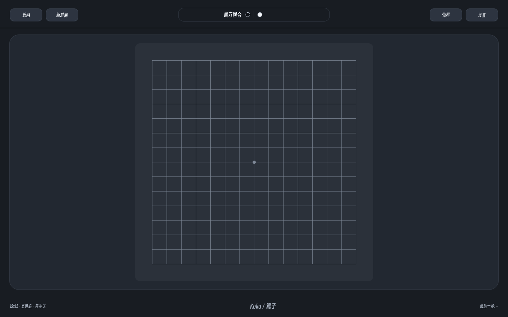
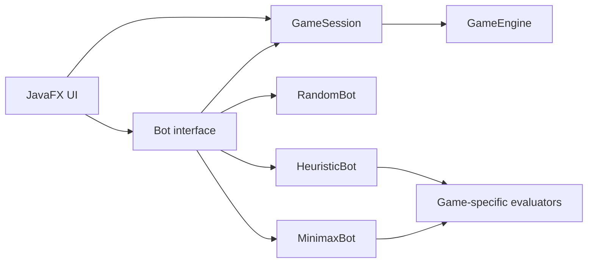
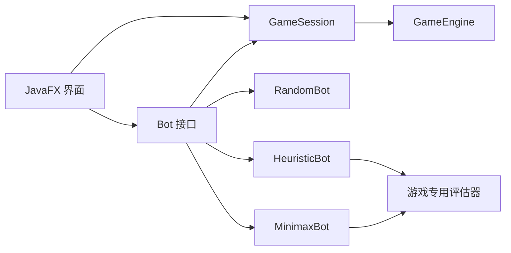

# Koku / 观子

<p align="center">
  
</p>

<p align="center">
  A cross-platform JavaFX board-game collection with configurable rules and three-level AI opponents.
</p>

<p align="center">
  <a href="#english">English</a> · <a href="#中文">中文</a> ·
  <a href="https://github.com/yiyangbear/koku/releases">Releases</a>
</p>

<p align="center">
  
</p>

---

## English

### Project Overview

**Koku** is a desktop collection of four grid-based strategy games built with Java and JavaFX. It began as a Gomoku program and was refactored into an extensible platform with shared game sessions, independent rule engines, reusable board views, configurable settings, and AI opponents.

The project demonstrates object-oriented design, game-state modeling, adversarial search, heuristic evaluation, internationalization, responsive desktop UI design, automated testing, and native application packaging.

### Key Results

- Four playable games in one application
- Local two-player and human-versus-computer modes
- Three AI difficulty levels with game-aware strategies
- Configurable player order, timers, Gomoku board size, and forbidden-move rules
- Undo, reset, win, draw, forbidden-move, and timeout handling
- Dark/light themes and Chinese/English interfaces
- Responsive JavaFX layout for macOS and Windows
- Native packaging support through `jpackage`
- Focused JUnit tests for core AI behavior

### Supported Games

| Game | Board and objective | Game-specific behavior |
| --- | --- | --- |
| Tic-Tac-Toe | 3×3, connect three | Complete search is practical on the small state space |
| Connect Four | 6×7, connect four | Pieces fall to the lowest available cell in a column |
| Gomoku | Configurable square board, connect five | Optional overline, double-four, and double-three forbidden-move checks |
| Six-in-a-Row | 19×19, connect six | Black places one opening stone; later turns place two stones |

### AI Opponents

The AI layer exposes a common `Bot` interface. Each bot receives the current engine state and returns a legal move without coupling the search algorithm to JavaFX.

| Difficulty | Strategy | Current implementation |
| --- | --- | --- |
| Easy | Random legal move | Enumerates valid cells or valid Connect Four columns |
| Normal | Heuristic search | Game-specific evaluators, tactical pattern scores, center preference, and nearby-candidate filtering |
| Hard | Minimax-based search | Full Minimax for Tic-Tac-Toe; depth-limited Minimax with Alpha-Beta pruning for Connect Four; candidate-limited shallow Minimax for Gomoku |

For Gomoku, the candidate generator reduces the large search space by concentrating on cells near existing stones. When forbidden moves are enabled, illegal black moves are filtered before selection. Six-in-a-Row currently uses the heuristic strategy as the Hard-mode fallback because a dedicated multi-stone search model has not yet been implemented.



### Gameplay and Desktop Experience

- Select a game from the shared game-selection screen
- Choose local multiplayer or human-versus-computer mode
- Choose whether the human or AI moves first
- Switch AI difficulty between Easy, Normal, and Hard
- Start a new match or undo the most recent turn
- Enable per-move or total-game timers
- Toggle coordinates and the last-move marker
- Apply settings from a compact side panel
- Switch language and theme without restarting
- View localized status messages and game-over feedback

The board scales with the available window space while a protected minimum window size prevents controls from overlapping. Connect Four uses a specialized gravity-aware view; the remaining games share the canvas-based board renderer.

### Architecture

| Layer | Responsibility |
| --- | --- |
| `app` | Application launch, menus, and top-level navigation |
| `config` | Rules, game mode, player order, timers, theme, and language |
| `domain` | Boards, moves, players, results, rule checking, and game engines |
| `game` | Game definitions, registry, and engine/view factories |
| `ai` | Bot interface, difficulty strategies, search, and board evaluators |
| `service` | Game session, timers, settings, internationalization, and themes |
| `ui` | JavaFX views, board rendering, status displays, and settings controls |

This separation lets a new game provide its own engine and view factory while reusing the shared session, settings, localization, and desktop shell.

### Project Structure

```text
src
├── main
│   ├── java/com/example/koku
│   │   ├── ai/evaluator
│   │   ├── app
│   │   ├── config
│   │   ├── domain/engine
│   │   ├── game
│   │   ├── service
│   │   └── ui/boards
│   └── resources
│       ├── fonts
│       ├── i18n
│       └── icons
└── test/java/com/example/koku/ai
```

### Run, Test, and Build

Requirements: JDK 25, Maven 3.9 or later, and Git.

```bash
git clone https://github.com/yiyangbear/koku.git
cd koku
mvn clean javafx:run
```

```bash
mvn test
mvn clean package
```

### Native Packaging

The macOS release script builds the JAR, gathers runtime dependencies, generates the `.icns` icon, validates an application image, and creates a DMG:

```bash
./scripts/release-mac.sh 1.0.0
```

Windows packages can be created on Windows with `jpackage` after preparing the application JAR and runtime dependencies:

```powershell
jpackage `
  --type exe `
  --name Koku `
  --app-version 1.0.0 `
  --input build/package-input `
  --main-jar koku-1.0-SNAPSHOT.jar `
  --main-class com.example.koku.app.KokuLauncher `
  --dest build/dist `
  --win-menu `
  --win-shortcut
```

Prebuilt packages, when available, are published on the [Releases](https://github.com/yiyangbear/koku/releases) page. Packages are not currently code-signed, so the operating system may display a first-launch security warning.

### Verification

The focused AI test suite checks that:

- Easy AI selects an unoccupied legal cell
- Hard Tic-Tac-Toe AI takes an immediate winning move
- Hard Tic-Tac-Toe AI blocks an immediate loss
- Hard Connect Four AI takes an immediate winning column

Run `mvn test` to reproduce these checks. Random tie-breaking keeps repeated games from becoming identical when several moves receive the same score.

### Current Limitations and Next Steps

- Six-in-a-Row Hard mode currently falls back to heuristic play
- Search depths are fixed and intentionally bounded for desktop responsiveness
- Deeper searches should eventually run on a background JavaFX task
- Settings and game records are not persisted between launches
- Online multiplayer and game replay are not implemented
- macOS and Windows packages are not code-signed

These limitations are explicit so completed work can be evaluated separately from planned work.

### Font and License

Koku bundles **Smiley Sans / 得意黑**, distributed under the SIL Open Font License 1.1. If it cannot be loaded, JavaFX falls back to the operating system's system font.

No project-wide open-source license has been specified yet.

---

## 中文

### 项目简介

**Koku / 观子** 是一个使用 Java 与 JavaFX 开发的跨平台桌面棋类合集，包含井字棋、四子棋、五子棋和六子棋。项目最初是单一的五子棋程序，随后被重构为具有统一对局会话、独立规则引擎、可复用棋盘视图、可配置设置系统和 AI 对手的扩展型棋类平台。

本项目集中展示了面向对象设计、游戏状态建模、对抗搜索、启发式评估、国际化、响应式桌面 UI、自动化测试和原生应用打包等实践成果。

### 核心成果

- 一个应用内支持四种棋类游戏
- 支持本地双人和人机对战
- 提供三档具有不同策略的 AI 难度
- 可配置玩家先后手、计时器、五子棋棋盘尺寸和禁手规则
- 支持悔棋、重置、胜负、平局、禁手和超时判定
- 支持深色/浅色主题及中英文界面
- 面向 macOS 与 Windows 的响应式 JavaFX 布局
- 通过 `jpackage` 支持原生桌面应用打包
- 使用 JUnit 验证关键 AI 行为

### 支持的游戏

| 游戏 | 棋盘与目标 | 特有规则 |
| --- | --- | --- |
| 井字棋 | 3×3，率先三连 | 状态空间较小，可以进行完整搜索 |
| 四子棋 | 6×7，率先四连 | 棋子自动落入所选列的最低空位 |
| 五子棋 | 可配置方形棋盘，率先五连 | 可选长连、双四、双三等禁手检测 |
| 六子棋 | 19×19，率先六连 | 黑方首手一子，之后每回合落两子 |

### AI 对手

AI 层通过统一的 `Bot` 接口接收当前棋局状态并返回合法落子，使搜索算法不依赖 JavaFX 界面。

| 难度 | 策略 | 当前实现 |
| --- | --- | --- |
| 简单 | 随机合法落子 | 枚举空位；四子棋只枚举仍可落子的列 |
| 普通 | 启发式搜索 | 游戏专用评估器、战术棋型评分、中心偏好和邻近候选点筛选 |
| 困难 | 基于 Minimax 的搜索 | 井字棋使用完整 Minimax；四子棋使用限制深度的 Minimax 与 Alpha-Beta 剪枝；五子棋使用候选点限制的浅层 Minimax |

五子棋 AI 会优先搜索已有棋子附近的位置，以控制大棋盘的搜索规模。启用禁手规则后，AI 执黑时会在选择前排除非法落子。六子棋尚未实现专用的多落子搜索模型，因此困难模式暂时回退到启发式策略。



### 对局与桌面体验

- 从统一页面选择四种棋类
- 选择本地双人或人机对战模式
- 选择玩家先手或后手及三档 AI 难度
- 新建对局或撤销最近一轮落子
- 开启每手计时或全局计时
- 切换坐标显示和最近一步标记
- 在侧边设置面板中应用规则
- 无需重启即可切换语言和主题
- 显示本地化回合状态和对局结果

棋盘会根据窗口空间自动缩放，并通过最小窗口尺寸避免控件重叠。四子棋使用独立的重力落子视图，其余游戏复用基于 Canvas 的棋盘渲染。

### 架构设计

| 模块 | 职责 |
| --- | --- |
| `app` | 应用启动、菜单和顶层页面导航 |
| `config` | 规则、对局模式、先后手、计时器、主题和语言配置 |
| `domain` | 棋盘、落子、玩家、结果、规则检查和游戏引擎 |
| `game` | 游戏定义、注册表以及引擎/视图工厂 |
| `ai` | Bot 接口、难度策略、搜索算法和棋盘评估器 |
| `service` | 对局会话、计时、设置、国际化和主题服务 |
| `ui` | JavaFX 视图、棋盘渲染、状态显示和设置控件 |

新增游戏时可以提供独立的规则引擎和视图工厂，同时复用统一的会话、设置、国际化和桌面应用外壳。

### 从源码运行

环境要求：JDK 25、Maven 3.9 或更高版本、Git。

```bash
git clone https://github.com/yiyangbear/koku.git
cd koku
mvn clean javafx:run
```

运行测试并构建 JAR：

```bash
mvn test
mvn clean package
```

### 原生应用打包

macOS 发布脚本会构建 JAR、收集运行时依赖、生成图标、验证应用镜像并创建 DMG：

```bash
./scripts/release-mac.sh 1.0.0
```

Windows 可在准备好应用 JAR 与运行时依赖后使用 `jpackage` 创建安装包，参数参见英文部分。预构建安装包会在可用时发布到 [Releases](https://github.com/yiyangbear/koku/releases) 页面。目前安装包尚未进行代码签名。

### 自动化验证

当前 AI 测试验证简单 AI 的合法落子，以及困难井字棋和四子棋 AI 的立即取胜与防守能力。执行 `mvn test` 即可复现全部检查。

### 当前限制与后续方向

- 六子棋困难模式目前回退到启发式策略
- 搜索深度固定，并为桌面响应速度进行了限制
- 更深的搜索未来应放入 JavaFX 后台任务
- 设置和棋谱尚未在应用退出后持久化
- 尚未实现在线对战和棋局回放
- macOS 与 Windows 安装包尚未进行代码签名

明确列出这些限制，便于将当前已经完成的成果与未来计划分开评估。

### 字体与许可证

Koku 内置 **Smiley Sans / 得意黑**，该字体基于 SIL Open Font License 1.1 发布。如果加载失败，JavaFX 会回退到操作系统的系统字体。

本项目目前尚未指定统一的开源许可证。
